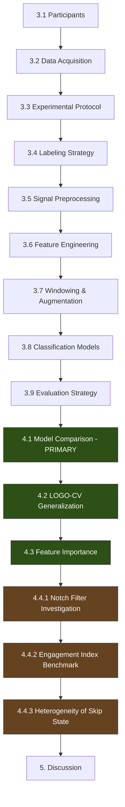

# The Neurological Signature of TikTok: Predicting Micro-Decisions during Naturalistic TikTok Time Allocation from Consumer-Grade EEG using Machine Learning Methods

> Alternative shorter title: *"Predicting Micro-Decisions during Naturalistic TikTok Time Allocation using Machine Learning Methods"*
> Both work — the longer version signals EEG upfront, which helps readers immediately understand the modality.

---

## 1. Introduction (Narrative Framing)

### Why This Matters

Short-form video platforms like TikTok now shape how billions of people allocate their attention — in bursts of seconds. Every swipe is a micro-decision: stay or skip. These micro-decisions, repeated hundreds of times per session, determine what information people absorb, what health messages (NOTE: do not mention health yet, first describe the pattern of whats happening, expalining decisions and these machenics broadly so meaning picking them up where they are, which is not where we are, and then developing into health messaging after) reach them, and what behaviors get reinforced.

For **public health**, this has direct consequences:
- **Health communication** depends on capturing attention in the first seconds — if a health promotion video gets skipped, the message never lands
- **Behavior change interventions** delivered via social media must compete with entertainment content for the same micro-decisions
- **Storytelling for health promotion** needs to understand *what makes a brain disengage* — not just what people say they liked, but what their neural state was before they swiped away

Understanding the *neural signature* of an impending skip — before it happens — opens the door to designing content that sustains engagement precisely when the brain is about to disengage. This is not about manipulation; it is about making health-relevant content as neurologically compelling as the entertainment it competes with.

### Abstract (Core Contribution)

This thesis investigates whether consumer-grade EEG can predict skip behavior during naturalistic TikTok browsing. Using a Muse S headband (4 channels, 256 Hz), we recorded brain activity from [N] participants while they freely browsed their personal TikTok feed. Each video transition was marked by keypress, creating a binary classification task: *about to skip* (3-second pre-skip window) vs. *not about to skip* (engaged viewing).

We compared three machine learning model families — Decision Tree, Random Forest, and Transformer — in a per-participant evaluation framework, and assessed cross-participant generalizability using Leave-One-Group-Out cross-validation. The Random Forest (200 trees, 112 frequency-domain features) achieved the highest consistent performance at [X]% mean accuracy across [N] participants (95% CI: [lo–hi]%), significantly above the 50% chance baseline.

Feature importance analysis revealed that **high-gamma activity (40–60 Hz)** at frontal (AF7/AF8) and temporal (TP9/TP10) electrodes was the most consistently predictive signal. An empirical investigation of the 50Hz notch filter confirmed that this signal reflects genuine neural activity rather than power line artifact. The standard Engagement Index (β/(α+θ)) failed to discriminate skip from non-skip states, suggesting that gamma-band activity — not captured by traditional engagement metrics — carries the critical information.

Skip behavior analysis revealed class heterogeneity (15% of the target class consisted of contiguous rapid-skipping windows), indicating that the classifier highly correlates with a broader **attentional state** (disengaged browsing mode) rather than purely isolated content-specific skip intent. These findings contribute to understanding how the brain allocates attention during naturalistic short-form media consumption.

---

## Guiding Principles from Supervisor Feedback

| Feedback | Action |
|----------|--------|
| **Exclude experimenter data** | P1 (your own data) is used for development only — **never reported** in results tables |
| **LOGO-CV for generalization** | Leave-One-Group-Out cross-validation: train on n-1, test on 1, report per-participant + aggregate |
| **Notch filter = additional finding** | Don't present as method choice upfront — present as an empirical investigation in results |
| **Show notch effect for both model types** | Already done: V2 Transformer + V4 RF both tested ✅ |
| **We do more than just feature selection** | Methods section must clearly describe all analyses (EI, bias, explainability, cross-participant) |

---

## Proposed Section Structure

### 3. Materials and Methods

> [!TIP]
> Mirror supervisor's paper: Participants → Hardware → Protocol → Preprocessing → Feature Extraction → Models → Evaluation. This is the standard structure for EEG classification papers.

---

#### 3.1 Participants

```
- n = [TOTAL_RECRUITED] participants recruited ([N_F] female, [N_M] male)
- Age range: [MIN]–[MAX] years (µ = [MEAN], σ = [SD])
- [N_EXCLUDED] participants excluded due to [REASONS: poor signal quality / insufficient keypresses / etc.]
- Final sample: n = [FINAL_N] (excluding the experimenter, who designed and conducted the study)
- Inclusion criteria: normal or corrected vision, no history of neurological disorders
- All participants provided informed consent
```

> [!IMPORTANT]
> Per supervisor: The experimenter (who designed the experiment) participates as test subject for pipeline development but is **excluded from all reported results**. This eliminates experimenter bias.

**Exclusion strategy (two tiers):**

| Tier | Criterion | Action | Justification |
|------|-----------|--------|---------------|
| **A priori** | Neurological disorder | Exclude | Fundamentally alters baseline EEG |
| **A priori** | Excessive keypress errors (self-reported >10) | Exclude | Compromises label integrity |
| **A priori** | Experimenter (P1) | Exclude | Experimenter bias |
| **Sensitivity** | Psychoactive medication, ADHD, caffeine, unusual sleep, etc. | Include; validate via sensitivity analysis | Per-participant models are self-controlled — individual differences don't contaminate other participants |

> **Sensitivity analysis**: Run the full pipeline with all included participants, then re-run excluding flagged subgroups (e.g., ADHD n=3, medication n=1). If aggregate results (mean accuracy, CI) do not meaningfully change → report inclusion with sensitivity confirmation. If a participant is a clear outlier → report results both with and without, discuss in Section 5.

---

#### 3.2 Data Acquisition

**Hardware:**
- Muse S Headband (Gen 2), consumer-grade EEG
- 4 dry electrodes: AF7, AF8, TP9, TP10 (international 10–20 system)
- Reference electrode at Fpz
- Sampling rate: 256 Hz
- Data streamed via LSL (Lab Streaming Layer) protocol using `muselsl`

**Software:**
- Custom Python recording script with real-time frequency monitoring
- Keypress markers embedded in EEG stream: `A` = TikTok video transition (swipe), `B` = baseline period
- Auto-reconnect mechanism for handling Bluetooth disconnections
- [DESCRIBE: any screen recording / video sync if applicable]

---

#### 3.3 Experimental Protocol

**Stimuli:** TikTok's "For You" feed — participants freely browsed their own personalized feed

**Procedure:**
1. **Baseline recording** (eyes open/closed) — [DURATION]s resting-state EEG
2. **Free browsing session** — [DURATION] minutes of natural TikTok use
3. Participant pressed `A` each time they swiped to the next video (skip event)
4. Participant pressed `B` to mark baseline transitions

```
Timeline:
[Baseline_1] → [TikTok Free Browsing, ~30 min] → [Baseline_2 if applicable]
     ↓                      ↓
  Resting EEG       Keypresses mark every swipe
```

**Key design choice — ecological validity:**
> Unlike controlled emotion-elicitation studies (e.g., [supervisor's paper]), this study uses **naturalistic stimuli** (participant's own TikTok feed). The trade-off: we gain ecological validity but lose control over stimulus content. This means labels are derived from **behavioral cues** (skip timing) rather than self-report.

---

#### 3.4 Labeling Strategy

**Binary classification target:** Predict whether the user is *about to skip* the current video.

| Class | Definition | Signal Source |
|-------|-----------|---------------|
| `about_to_skip` | 3-second window **ending at** each keypress_A | Pre-decision neural state |
| `not_about_to_skip` | All other TikTok viewing periods (excluding baselines) | Engaged viewing state |

#### 3.4.1 Labeling Strategy Justification for 3-second window
- Motor preparation and decision-making in the brain occurs 1–3 seconds before voluntary action [CITE: Libet, readiness potential literature]
- Empirically tested against [other window sizes if tested]
- Baselines excluded from training (kept only for quality assessment)

---

#### 3.5 Signal Preprocessing

**Step 1: Quality checks**
- Visual inspection of raw EEG waveforms
- Verification of sampling rate consistency (median inter-sample interval)
- Exclusion criteria: [DESCRIBE: e.g., >X% data loss, flat channels, etc.]

**Step 2: Frequency band extraction**
- Butterworth bandpass filter (4th order) applied per channel to extract 7 frequency bands:

| Band | Range (Hz) | Neural Correlate |
|------|-----------|-----------------|
| Delta | 1–4 | Deep attention states |
| Theta | 4–8 | Memory encoding, sustained attention |
| Alpha | 8–13 | Relaxation, cortical idling |
| Beta | 13–30 | Active cognitive processing |
| Low Gamma | 30–40 | Cognitive binding |
| High Gamma | 40–60 | Decision-making, learning |
| Very High | 60–100 | Exploratory (above typical EEG range) |

> [!NOTE]
> **No 50Hz notch filter was applied** in the primary analysis. The rationale for this decision is presented empirically in Section [4.X — Notch Filter Investigation].

---

#### 3.6 Feature Engineering

**For ML models (Decision Tree, Random Forest):**
- Each 3-second sample block → aggregate statistics per band per channel
- 4 statistics × 7 bands × 4 channels = **112 features**
- Statistics: mean, standard deviation, minimum, maximum

| Feature | Example | Count |
|---------|---------|-------|
| Band power (mean, std, min, max) | `AF8_high_gamma_mean` | 28 × 4 = 112 |

**For Transformer model:**
- Raw frequency band signals (7 bands × 4 channels = 28 time series)
- Interpolated to 256 Hz within each 3-second window (768 time steps)
- No handcrafted aggregation — model learns temporal patterns directly

---

#### 3.7 Windowing and Data Augmentation

- **Skip samples**: One 3-second window ending at each keypress_A (no overlap)
- **Non-skip samples**: Sliding windows with **80% overlap** (stride = 0.6s) across contiguous `not_about_to_skip` regions
- This produces ~3× more non-skip than skip samples before rebalancing

**Rebalancing:** Random undersampling of majority class to achieve exact 50/50 balance (seed = 42 for reproducibility)

---

#### 3.8  Machine Learning Classification Models

Three model families were compared, ordered by interpretability:

| Model | Type | Key Hyperparameters | Explainability/Interpretability |
|-------|------|-------------------|-----------------|
| **Decision Tree** | Single tree | max_depth=5, min_samples_leaf=10 | ✅ Full (explicit rules) |
| **Random Forest** | Ensemble (200 trees) | max_depth=7, min_samples_leaf=5 | ✅ Feature importance + example trees |
| **Transformer** | Deep learning (attention) | [DESCRIBE: heads, layers, d_model] | ⚠️ Gradient-based importance only |

> [!NOTE]
> Model progression follows an **interpretability-first** strategy: starting with fully transparent DT, scaling to RF for accuracy, and finally testing a Transformer to assess whether deep learning captures patterns missed by handcrafted features.

---

#### 3.9 Evaluation Strategy

**Primary evaluation: Per-participant training and testing**
- 60/40 stratified train/validation split (no temporal leakage — split at sample level after shuffling balanced dataset)
- Metrics: Accuracy, Precision, Recall, F1-Score
- Reported per participant + aggregate (mean, SD, 95% CI)

**Generalization evaluation: Leave-One-Group-Out Cross-Validation (LOGO-CV)**

> [!IMPORTANT]
> Per supervisor's recommendation: In each fold, one participant's data is held out as the test set, and all remaining participants' data form the training set. Results reported as:
> 1. Per-participant accuracy (each participant as test subject once)
> 2. Distribution (boxplot / histogram across folds)
> 3. Aggregate (mean ± SD, 95% CI)

```
LOGO-CV Procedure (n participants):
  For i = 1 to n:
    Train on: all participants except P_i
    Test on:  P_i only
    Record:   accuracy_i, precision_i, recall_i, F1_i
  Report: mean(accuracy), SD, 95% CI, per-participant table
```

**Statistical tests:**
- Mann-Whitney U test for non-parametric comparisons (e.g., EI between classes)
- Cohen's d for effect size
- Significance level α = 0.05
- [Consider: paired Wilcoxon signed-rank test for model comparisons across participants]

---

### 4. Results

> [!TIP]
> Present results in a **narrative arc**: start with the primary model comparison, then present the additional investigations that justify design decisions and deepen understanding. This follows the supervisor's paper pattern of presenting core results first, then ablation studies.

---

#### 4.1 Per-Participant Model Comparison (Primary Result)

> **Core result table — the centerpiece of the thesis.**

Present the best config of each model family (DT, RF, Transformer) across all n=[FINAL_N] participants:

| Participant | DT (depth=5) | RF (200 trees) | Transformer | Best |
|-------------|-------------|----------------|-------------|------|
| P2 | [X]% | [X]% | [X]% | [MODEL] |
| P3 | [X]% | [X]% | [X]% | [MODEL] |
| ... | ... | ... | ... | ... |
| P[n] | [X]% | [X]% | [X]% | [MODEL] |
| **Mean** | **[X]%** | **[X]%** | **[X]%** | **[MODEL]** |
| SD | [X]% | [X]% | [X]% | — |
| 95% CI | [lo–hi]% | [lo–hi]% | [lo–hi]% | — |

> **P1 (experimenter) excluded from this table and all aggregate statistics.**

**What we CAN say:**
- Which model family achieves highest mean accuracy across participants
- Whether the method reliably beats the 50% chance baseline (95% CI lower bound > 50%)
- Consistency across participants (coefficient of variation)

**What we CANNOT say:**
- That the model detects "intent to skip" — it detects a neural state difference, which *correlates* with upcoming skip behavior
- That results generalize to other platforms or stimuli (only TikTok For You feed tested)
- That results generalize to populations not represented in the sample

---

#### 4.2 Cross-Participant Generalization (LOGO-CV)

> Per supervisor's recommendation.

| Test Participant | Train Set | Accuracy | F1 |
|-----------------|-----------|----------|-----|
| P2 | All except P2 | [X]% | [X] |
| P3 | All except P3 | [X]% | [X] |
| ... | ... | ... | ... |
| **Mean** | — | **[X]%** | **[X]** |

**What we CAN say:**
- Whether a model trained on other participants can predict skip behavior for a new, unseen participant
- Degree of inter-individual variability in neural skip signatures

**What we CANNOT say:**
- That cross-participant failure means EEG is not useful (personalized models may still work well)
- Anything about transfer to different demographics or devices

---

#### 4.3 Feature Importance and Explainability

> This section justifies which brain signals are actually driving predictions.

**4.3.1 Random Forest Feature Importance**
- Aggregate top-20 features across all participants (bar plot)
- Electrode × frequency band heatmap
- Example decision tree from ensemble (Figure)
- Example decision rules (text)

**4.3.2 Consistency Analysis**
- Which features appear in top-10 for ≥60% of participants?
- Electrode dominance: frontal (AF7/AF8) vs temporal (TP9/TP10)
- Frequency band dominance: high_gamma (40–60Hz) expected to dominate

**What we CAN say:**
- High-gamma activity (40–60Hz) at frontal and temporal electrodes is *consistently predictive* of skip behavior
- The RF model uses interpretable frequency-domain features — not black-box
- Decision rules can be extracted and inspected

**What we CANNOT say:**
- That these features *cause* skipping (correlation ≠ causation)
- The exact cognitive process these features represent (only that they correlate with gamma literature on decision-making)

---

#### 4.4 Additional Investigations

> [!NOTE]
> Per supervisor: these are **additional findings** that deepen the analysis without being the core contribution.

---

##### 4.4.1 Effect of 50Hz Notch Filter

> **Empirical investigation:** Does removing the 50Hz component (standard practice for power line noise) help or hurt prediction?

**Motivation:** The high-gamma band (40–60Hz) overlaps with 50Hz power line interference. Standard practice applies a notch filter, but this risks removing genuine neural signal.

| Model | Without Notch (Mean Acc.) | With Notch (Mean Acc.) | Δ |
|-------|--------------------------|----------------------|---|
| Transformer (V2) | [X]% | [X]% | [X]% |
| Random Forest (V4) | [X]% | [X]% | [X]% |

**What we CAN say:**
- The notch filter consistently *decreases* accuracy across both model types and [N] participants
- This is evidence that the 40–60Hz signal captured by these electrodes contains genuine predictive neural activity, not purely artifact
- Consumer-grade devices in typical indoor environments may not suffer from 50Hz contamination as strongly as clinical setups

**What we CANNOT say:**
- That there is *zero* power line contamination (some 50Hz artifact may co-exist with genuine gamma signal)
- That this finding generalizes to other recording environments (different buildings, different countries with 60Hz power)

> Supervisor note: "I suggest you can keep this as additional findings. It makes more sense if you could show the same performance drop for more than 3 participants" → With n=30 this will be much more convincing.

---

##### 4.4.2 Engagement Index Analysis

> **Benchmark against established neuroscience metric.**

**Engagement Index:** EI = β / (α + θ), averaged across 4 electrodes per 3-second window.

| Comparison | EI (Skip) | EI (No Skip) | p-value | Cohen's d | Sig |
|------------|-----------|-------------|---------|-----------|-----|
| Aggregate | [X] | [X] | [X] | [X] | [n.s. / *] |
| Per-participant breakdown | ... | ... | ... | ... | ... |

**What we CAN say:**
- The standard EI formula does not reliably differentiate skip from non-skip states
- This supports the finding that **high-gamma (not included in standard EI)** is the real discriminative signal
- Our ML approach captures information that traditional neuroscience metrics miss

**What we CANNOT say:**
- That EI is useless in general (it was designed for different constructs — sustained attention, not micro-decisions)
- That the EI formula should be modified to include gamma (would require separate validation study)

---

##### 4.4.3 Skip Behavior Bias Analysis

> **Behavioral investigation:** Are skip decisions independent events, or do they show sequential dependency?

- Distribution of skip chain lengths (histogram)
- Proportion: single skips vs. chains of 2–4 vs. chains of 5+
- Implications for what the classifier is actually detecting

**What we CAN say:**
- Skip behavior creates **contiguous target blocks** — rapid skipping merges samples into longer consecutive "about_to_skip" sequences.
- 85% of our target class represents isolated disengagements, while 15% represents a state of rapid browsing.
- The classifier therefore flags a heterogeneous **attentional state** (disengaged browsing mode + isolated skips) rather than a perfectly uniform content-specific "intent to skip".

**What we CANNOT say:**
- The exact proportion of neural signal that is content-driven vs. state-driven.
- That the predictive model perfectly isolates the moment of decision (it isolates the *state* preceding the swiping behavior).

---

### 5. Discussion

Suggested structure:

1. **Summary of key findings** — RF as best consistent model, high-gamma dominance, personalized > cross-participant
2. **Comparison to literature** — how does ~75% compare to other EEG-based BCI studies with consumer-grade devices? Compare to supervisor's paper results with Muse (~82% F1 for emotion, but different task and controlled stimuli)
3. **The high-gamma question** — why 40–60Hz is both the most predictive and the most controversial band (artifact vs. neural signal debate), supported by notch filter experiment
4. **Ecological validity vs. control** — trade-offs of using real TikTok vs. controlled video stimuli
5. **Limitations:**
   - Consumer-grade device (4 channels, dry electrodes, Bluetooth artifacts)
   - No physiological ground truth for "engagement" (only behavioral proxy)
   - [N] participants from [DEMOGRAPHIC_DESCRIPTION] — may not generalize
   - TikTok's recommendation algorithm creates participant-specific stimulus distributions
   - 80% overlap in windowing may introduce subtle temporal autocorrelation in training data
6. **Future work:**
   - Multi-modal fusion (EEG + eye tracking + facial EMG)
   - Online/real-time prediction during live browsing
   - Larger and more diverse participant pool
   - Transfer learning across participants

---

## Chronological Flow Summary



**Green** = Core contribution (what gets reported in abstract)
**Brown** = Additional findings (deepen the story, address reviewer questions preemptively)

---

## What to Re-run (n=25 Baseline, n=30 Optional)

Statistical significance testing on the $n=25$ dataset using our primary clinical metric (Recall vs 50% chance, one-sample t-test) yields a p-value of $1.76 \times 10^{-8}$ and a massive effect size (Cohen's d = 1.65). **Therefore, $n=25$ is more than scientifically sufficient and constitutes the baseline thesis dataset.** Collecting data for up to $n=30$ is an optional stretch goal.

Once the final dataset is frozen (whether at 25 or 30), re-run the following in order:

| Step | Script | What Changes |
|------|--------|-------------|
| 1 | `post2v2_add_skip_classification.py` | New skip labels for each participant |
| 2 | `prediction_4_rf.py --nonotch` | RF without notch (primary) |
| 3 | `prediction_4_rf.py` (no flag) | RF with notch (for Section 4.4.1) |
| 4 | `prediction_2.py --nonotch` | Transformer without notch |
| 5 | `prediction_2.py` (no flag) | Transformer with notch (for Section 4.4.1) |
| 6 | `prediction_3_dt.py --nonotch` | Decision Tree (for model comparison) |
| 7 | `analysis_8_engagement_index.py --nonotch` | EI analysis (for Section 4.4.2) |
| 8 | `investigation_7_skip_bias.py` | Skip bias analysis (for Section 4.4.3) |
| 9 | **NEW: LOGO-CV script** | Cross-validation (for Section 4.2) |

> [!IMPORTANT]
> **Exclude experimenter (P1) data** from all aggregate results and statistical tests. P1 can be mentioned as "development data used for pipeline validation" but never in results tables.
